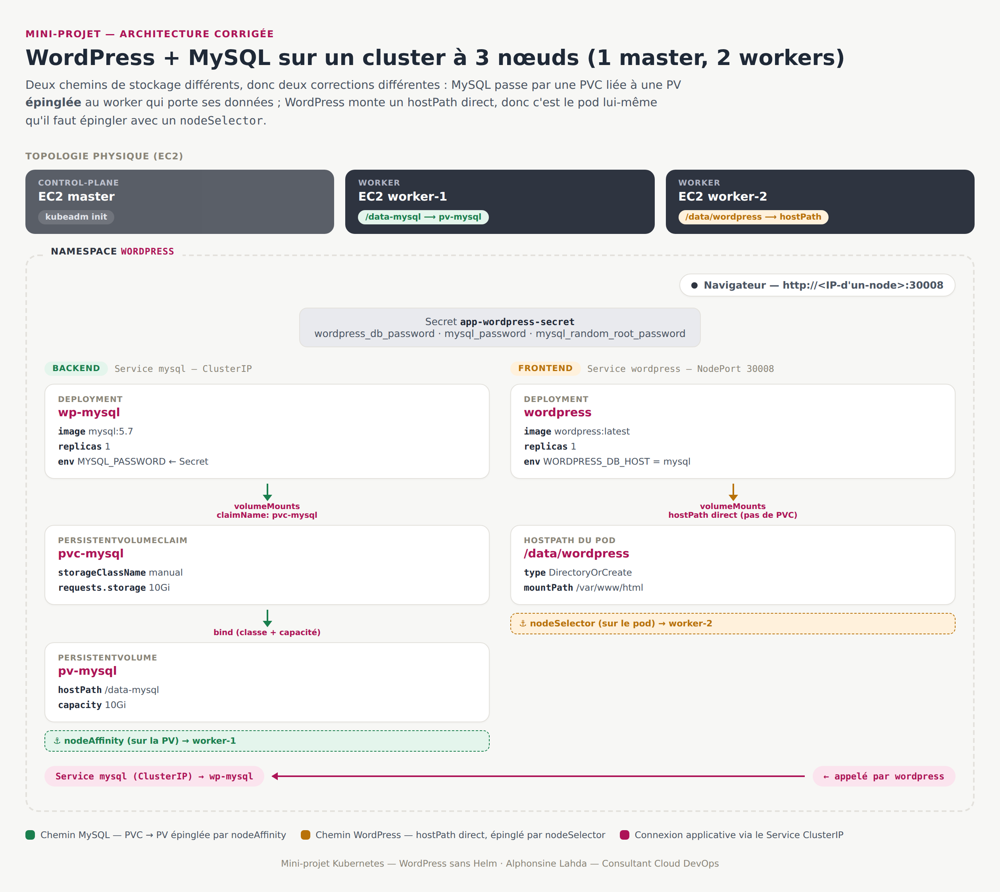

# Mini-projet : déployer WordPress par manifests, version corrigée et expliquée pas à pas

*Environnement cible : cluster kubeadm avec 1 VM EC2 master et 2 VM EC2 workers*

## Objectifs

- Déployer WordPress + MySQL sur Kubernetes **sans Helm**, uniquement avec des manifests YAML.
- Comprendre, étape par étape, pourquoi le stockage doit être pensé différemment sur un cluster **multi-nœuds** que sur un cluster à un seul nœud (type Minikube).
- Repartir d'un énoncé réaliste : celui fourni contenait 3 erreurs qui n'apparaissent **que** sur plusieurs nœuds. Ce document les explique une par une, en partant des bases, avant de donner les manifests corrigés.

## Comment lire ce document

Si tu débutes sur Kubernetes, commence par la partie 1 : elle rappelle en une phrase le rôle de chaque objet utilisé dans ce projet. Si tu es déjà à l'aise, tu peux aller directement à la partie 3 (les corrections) puis à la partie 5 (déploiement étape par étape). La partie 10, à la fin, reprend chaque manifest et explique **chaque ligne** une par une. Elle est utile si tu veux comprendre le YAML en détail plutôt que seulement l'utiliser.

## 1. Rappel : les briques Kubernetes utilisées dans ce projet

Avant de corriger quoi que ce soit, il faut savoir ce que fait chaque fichier. Ce mini-projet utilise 8 manifests, qui créent chacun un objet Kubernetes différent :

| Objet Kubernetes | À quoi il sert ici |
| --- | --- |
| `Namespace` | Une "boîte" qui isole toutes les ressources du projet du reste du cluster. |
| `Secret` | Stocke les mots de passe de la base de données, encodés en base64. |
| `PersistentVolume` (PV) | Réserve un espace disque réel sur un nœud précis du cluster. |
| `PersistentVolumeClaim` (PVC) | Une "demande" de stockage faite par une application ; elle se lie à une PV qui correspond à sa demande. |
| `Deployment` | Décrit comment faire tourner un pod (quelle image, combien de copies, quelles variables d'environnement, quels volumes monter). |
| `Service` de type `ClusterIP` | Donne une adresse stable **à l'intérieur** du cluster pour joindre un pod (ici : MySQL, joint uniquement par WordPress). |
| `Service` de type `NodePort` | Ouvre un port **vers l'extérieur** du cluster, sur tous les nœuds (ici : WordPress, pour qu'on puisse l'ouvrir dans un navigateur). |
| `hostPath` | Un volume qui pointe directement vers un dossier du disque local du nœud, sans passer par une PV/PVC. |

Le point le plus important à retenir de ce tableau pour la suite : **PV/PVC** et **hostPath direct** sont deux façons différentes de brancher un dossier du disque dans un pod. Ce mini-projet utilise les deux : une pour MySQL, une pour WordPress. C'est justement ce qui rend la correction du stockage un peu subtile.

## 2. Schéma d'architecture



Comment lire ce schéma :

- La bande du haut montre la **topologie physique** : les 3 VM EC2 (le master, et les 2 workers), avec le dossier local que chacun des deux workers va héberger.
- Le grand cadre pointillé représente le **Namespace `wordpress`**, c'est-à-dire tout ce que contient le projet.
- Le chemin **vert** (MySQL) passe par une PVC puis une PV : la contrainte de nœud est posée sur la PV.
- Le chemin **orange** (WordPress) va directement vers un `hostPath` : la contrainte de nœud est posée sur le pod lui-même.
- En bas, le `Service mysql` relie les deux côtés : c'est par lui que WordPress contacte la base de données, jamais par une adresse IP codée en dur.

## 3. Le problème de fond : pourquoi l'énoncé original ne suffit pas sur 3 nœuds

Imagine que chaque VM EC2 est un ordinateur séparé, avec son propre disque dur. Sur un cluster à un seul nœud (Minikube, par exemple), il n'y a qu'un seul disque possible : un `hostPath` pointe donc toujours vers le même endroit, quel que soit le pod qui le lit ou l'écrit, puisqu'il n'y a qu'un seul nœud sur lequel ce pod peut tourner.

Sur un cluster à plusieurs nœuds, ce n'est plus vrai du tout. Un `hostPath: /data/mysql` sur le worker-1 et un `hostPath: /data/mysql` sur le worker-2 portent le même nom de dossier, mais ce sont **deux dossiers vides et complètement différents** : chacun se trouve sur son propre disque. Si Kubernetes replanifie un pod sur l'autre worker (ce qui arrive après un redémarrage, une mise à jour, ou une panne), le pod redémarre avec un disque vide. C'est une perte de données silencieuse : rien ne plante, rien n'affiche d'erreur, mais les données ont disparu.

C'est le fil conducteur des 3 corrections de la partie suivante.

## 4. Les corrections, expliquées une par une

### 🐛 Correction 1 : la PV et la PVC de MySQL étaient créées... mais jamais utilisées

**Le problème.** Les manifests `pv-mysql.yml` et `pvc-mysql.yml` existaient bien dans le projet. Mais le `Deployment` de MySQL, lui, définissait son propre volume directement en `hostPath: /data/mysql`, sans jamais faire référence à la PVC. Résultat : la PV et la PVC étaient créées dans le cluster, visibles avec `kubectl get pv,pvc`, mais totalement inutilisées. MySQL écrivait ailleurs, sur un volume qui n'avait aucune protection.

**Pourquoi c'est un problème.** Ce genre de bug ne produit **aucune erreur visible**. Le déploiement réussit, l'application fonctionne. On ne s'en aperçoit que si on compare attentivement chaque `volumeMounts` d'un `Deployment` avec les ressources de stockage qu'on a réellement créées à côté.

**La correction.** Dans `mysql-deployment.yml`, on remplace le `hostPath` direct par une référence à la PVC :

```yaml
volumes:
  - name: mysql-persistent-storage
    persistentVolumeClaim:
      claimName: pvc-mysql
```

À partir de là, c'est la PVC qui décide du volume réellement utilisé. Et comme elle est liée à la PV `pv-mysql`, c'est finalement la PV qui a le dernier mot sur l'emplacement physique des données.

### 🐛 Correction 2 : aucune contrainte de nœud (le bug qui ne se voit qu'à plusieurs nœuds)

C'est la correction la plus importante pour ton environnement à 1 master + 2 workers, et celle qui demande le plus d'explication.

**Le problème.** Ni le volume de MySQL, ni celui de WordPress, n'étaient rattachés à un nœud précis. Rien n'empêchait Kubernetes de planifier le pod MySQL sur le worker-1 aujourd'hui, puis sur le worker-2 après un redémarrage demain, avec, comme expliqué en partie 3, un disque vide à l'arrivée.

**La correction dépend de la façon dont chaque application stocke ses données**, parce que MySQL et WordPress ne passent pas par le même mécanisme :

**a) Le cas de MySQL (passe par une PV/PVC).** Puisque la correction 1 a rebranché MySQL sur la PVC, il suffit d'ajouter la contrainte **une seule fois, sur la PV** (`pv-mysql.yml`). Kubernetes garantit alors que tout pod qui consomme la PVC liée à cette PV sera automatiquement planifié sur le bon nœud. Il n'y a donc rien à ajouter sur le `Deployment` lui-même.

```yaml
nodeAffinity:
  required:
    nodeSelectorTerms:
      - matchExpressions:
          - key: kubernetes.io/hostname
            operator: In
            values:
              - <NOM_DU_WORKER_MYSQL>
```

**b) Le cas de WordPress (hostPath direct, sans PV).** L'énoncé demande explicitement un volume monté dans `/data` du nœud, donc WordPress garde son `hostPath` direct : il n'y a pas de PV pour porter la contrainte à sa place. Il faut donc la poser **directement sur le pod**, avec un `nodeSelector` :

```yaml
spec:
  nodeSelector:
    kubernetes.io/hostname: <NOM_DU_WORKER_WORDPRESS>
```

Dans les deux cas, remplace `<NOM_DU_WORKER_MYSQL>` et `<NOM_DU_WORKER_WORDPRESS>` par les noms exacts de tes deux workers. Tu les obtiens avec :

```
kubectl get nodes
```

> ⚠️ Point de vigilance. Tu peux choisir le même worker pour MySQL et pour WordPress, ou un worker différent pour chacun. Les deux fonctionnent ; répartir sur deux workers différents répartit simplement la charge entre les deux machines.

### 🐛 Correction 3 : un champ `namespace` invalide sur la PersistentVolume

**Le problème.** `pv-mysql.yml` déclarait `namespace: wordpress` dans ses métadonnées.

**Pourquoi c'est un problème.** Une `PersistentVolume` est une ressource **cluster-scoped** : elle n'appartient à aucun namespace en particulier, elle est visible et utilisable depuis tout le cluster. Le champ `namespace` n'a donc pas de sens sur une PV, à la différence de la `PersistentVolumeClaim`, qui elle est bien namespacée (son `namespace: wordpress` dans `pvc-mysql.yml` était correct et n'a pas changé).

**La correction.** Le champ a simplement été retiré des métadonnées de `pv-mysql.yml`.

### Point de vigilance : encodage base64 du Secret

Ce n'est pas un bug qui empêche le projet de fonctionner, mais une bonne pratique à connaître. Les valeurs du `Secret` avaient été générées avec `echo "toto" | base64`. La commande `echo` ajoute, par défaut, un retour à la ligne invisible à la fin du texte : la valeur réellement stockée est donc `"toto\n"` et non `"toto"`. Pour un mot de passe, ce caractère invisible peut, selon les cas, causer des erreurs de connexion difficiles à diagnostiquer.

```
echo "toto" | base64          # -> dG90bwo=   (contient un \n caché)
printf '%s' "toto" | base64   # -> dG90bw==   (valeur exacte, sans \n)
```

La correction utilise `printf '%s'` à la place d'`echo`, pour obtenir l'encodage exact du mot de passe.

## 5. Étape par étape : comment déployer ce projet corrigé

### D'abord, la question la plus importante : où est-ce que je tape mes commandes ?

**Réponse courte : toutes les commandes `kubectl` de ce document se tapent au même endroit, sur le master. Jamais sur un worker.**

C'est un point qui bloque beaucoup de débutants, donc prenons le temps de l'expliquer. Dans un cluster kubeadm, les rôles sont strictement séparés :

- Le **master** (control-plane) fait tourner les composants qui pilotent le cluster (`kube-apiserver`, `etcd`, le scheduler...) et c'est sur cette VM qu'a été exécuté `kubeadm init`. C'est donc elle qui possède la configuration (`~/.kube/config`) permettant à la commande `kubectl` de parler au cluster. **C'est depuis le master que tu te connectes en SSH et que tu tapes toutes les commandes `kubectl` de ce document.**
- Les **workers** ne font tourner que les pods applicatifs (ici : MySQL et WordPress). Tu n'as **jamais besoin de te connecter en SSH à un worker** pour ce projet : tu ne tapes aucune commande dessus, tu n'y copies aucun fichier à la main.
- D'ailleurs, par défaut, kubeadm empêche volontairement le master d'exécuter des pods applicatifs (un mécanisme appelé *taint*). C'est pour ça que le choix se fait uniquement entre **worker-1** et **worker-2** pour `<NOM_DU_WORKER_MYSQL>` et `<NOM_DU_WORKER_WORDPRESS>` : le master n'est jamais une option valable.

Autrement dit : tu écris un fichier YAML sur le master, tu tapes `kubectl apply -f ...` sur le master, et c'est **Kubernetes lui-même** (le scheduler, qui tourne sur le master) qui décide d'envoyer le pod correspondant sur le bon worker, en lisant le `nodeSelector` ou la `nodeAffinity` que tu as écrite dans le fichier. Tu ne choisis jamais la machine "à la main" en t'y connectant ; tu le dis à Kubernetes dans le YAML, et il s'occupe du reste.

### Étape 1 : (sur le master) identifier les noms de tes deux workers

```bash
kubectl get nodes
```

Exemple de résultat :

```
NAME                STATUS   ROLES           AGE   VERSION
ip-172-31-1-10       Ready    control-plane   10d   v1.29.0
ip-172-31-5-21       Ready    <none>          10d   v1.29.0
ip-172-31-7-44       Ready    <none>          10d   v1.29.0
```

La ligne avec `control-plane` dans la colonne `ROLES`, c'est le master : tu ne la choisis jamais. Note les deux **autres** noms (ici `ip-172-31-5-21` et `ip-172-31-7-44`) : ce sont tes deux workers, ceux dont tu as besoin pour l'étape suivante.

### Étape 2 : (sur le master, dans un éditeur de texte) adapter les 2 manifests qui contiennent un placeholder

Cette étape ne touche aucun cluster, elle modifie juste deux fichiers texte sur le master, avant de les envoyer avec `kubectl apply` :

- Dans **`pv-mysql.yml`**, remplace `<NOM_DU_WORKER_MYSQL>` par le nom du worker choisi pour MySQL (un des deux noms de l'étape 1, jamais celui du master).
- Dans **`wordpress-deployment.yml`**, remplace `<NOM_DU_WORKER_WORDPRESS>` par le nom du worker choisi pour WordPress (même règle).

### Étape 3 : (sur le master) envoyer les 8 manifests au cluster, dans le bon ordre

L'ordre n'est pas arbitraire : chaque ressource doit exister avant celle qui en dépend (le `Namespace` avant tout le reste, le `Secret` et la `PersistentVolume`/`PersistentVolumeClaim` avant les `Deployment` qui les utilisent, chaque `Deployment` avant le `Service` qui le cible).

```bash
kubectl apply -f app-wordpress-namespace.yml
kubectl apply -f app-wordpress-secret.yml
kubectl apply -f pv-mysql.yml
kubectl apply -f pvc-mysql.yml
kubectl apply -f mysql-deployment.yml
kubectl apply -f mysql-cluster_ip.yml
kubectl apply -f wordpress-deployment.yml
kubectl apply -f wordpress-nodeport.yml
```

Ces 8 commandes se tapent toutes au même endroit (le master). C'est **après** cet envoi que Kubernetes agit tout seul sur les workers, sans que tu aies besoin d'y toucher. Voici, fichier par fichier, ce qui se passe réellement et sur quelle machine :

| Fichier appliqué | Ce que ça modifie, et où |
| --- | --- |
| `app-wordpress-namespace.yml` | Crée juste une entrée dans la base de données interne du cluster (`etcd`, sur le master). Aucune machine applicative n'est touchée. |
| `app-wordpress-secret.yml` | Pareil : stocké dans `etcd` sur le master. Rien sur les workers pour l'instant. |
| `pv-mysql.yml` | Enregistre, sur le master, la "promesse" qu'un espace disque existe à `/data-mysql` sur le worker MySQL. **Rien n'est encore créé physiquement sur le worker à ce stade.** |
| `pvc-mysql.yml` | Le master lie cette demande à la PV créée juste avant. Toujours rien sur les workers. |
| `mysql-deployment.yml` | **C'est ici que ça bouge enfin sur un worker.** Le scheduler (sur le master) lit la `nodeAffinity` de la PV et envoie le pod MySQL sur le worker choisi. C'est le `kubelet` de **ce worker-là** qui télécharge l'image `mysql:5.7`, démarre le conteneur, et crée réellement le dossier `/data-mysql` sur son propre disque si besoin. |
| `mysql-cluster_ip.yml` | Le master enregistre juste une règle réseau interne (un nom DNS `mysql`). Aucun fichier créé sur un worker. |
| `wordpress-deployment.yml` | Le scheduler lit le `nodeSelector` et envoie le pod WordPress sur le worker choisi. C'est le `kubelet` de **ce worker** qui télécharge l'image `wordpress:latest`, démarre le conteneur, et crée `/data/wordpress` sur son disque local (grâce à `type: DirectoryOrCreate`). |
| `wordpress-nodeport.yml` | Le master ouvre une règle réseau (le port 30008) sur **tous** les nœuds du cluster, master compris, même s'il n'y a pas de pod dessus. |

Un point important : tu n'as **jamais** à créer toi-même les dossiers `/data-mysql` ou `/data/wordpress` sur les workers. C'est le `kubelet` de chaque worker qui le fait automatiquement, au moment où le pod y est programmé.

### Étape 4 : (toujours sur le master) vérifier que tout est bien parti sur les bons workers

```bash
kubectl get all -n wordpress
kubectl get pv,pvc -n wordpress
kubectl get pods -n wordpress -o wide
```

La troisième commande est la plus utile pour répondre à "qu'est-ce qui tourne sur quelle machine" : l'option `-o wide` ajoute une colonne `NODE`, qui affiche noir sur blanc le nom du worker sur lequel chaque pod a atterri. Vérifie que ça correspond bien aux noms que tu as mis dans `pv-mysql.yml` et `wordpress-deployment.yml`.

Deux autres points à contrôler : la `PersistentVolumeClaim pvc-mysql` doit afficher le statut `Bound` (liée à sa PV), et les deux pods (`wp-mysql` et `wordpress`) doivent passer à l'état `Running`.

### Étape 5 : tester dans un navigateur (sur ton propre ordinateur, pas sur le cluster)

```
http://<IP_PUBLIQUE_D_UN_WORKER>:30008
```

Cette dernière étape ne se passe ni sur le master ni sur un worker : c'est toi, depuis le navigateur de ta machine perso, qui ouvres cette adresse. N'importe quelle IP publique de nœud du cluster fonctionne (master ou worker), puisqu'un `Service NodePort` ouvre son port sur **tous** les nœuds : c'est tout l'intérêt de ce type de `Service`.

## 6. Prérequis réseau : configurer le Security Group AWS

Ce mini-projet suppose que tes 3 VM EC2 peuvent déjà se parler entre elles sur le réseau. Si tu n'as pas encore ouvert ces règles au niveau du **Security Group**, le déploiement va démarrer sans erreur apparente (les pods passent `Running`) mais la communication entre nœuds échouera silencieusement. C'est un prérequis à régler **avant** l'étape 3, mais comme c'est une erreur très fréquente et facile à rater, elle est documentée ici en détail, avec son symptôme exact.

### 🐛 Bug rencontré en formation : security group incomplet entre les 3 VM

**Le symptôme observé.** Après un déploiement qui semblait réussi (`kubectl get pods -n wordpress -o wide` affiche les deux pods en `1/1 Running`, la PVC en `Bound`), deux choses ne fonctionnaient pas :

- `kubectl logs -n wordpress deploy/wp-mysql` renvoyait :
  ```
  Error from server: Get "https://172.31.33.202:10250/containerLogs/wordpress/wp-mysql-745c847d64-b7x84/mysql": dial tcp 172.31.33.202:10250: i/o timeout
  ```
- Le site WordPress affichait **Error establishing a database connection**.

**Pourquoi ces deux symptômes ont la même cause.** Un `i/o timeout` (et non un message de refus immédiat) est la signature typique d'un **security group qui bloque silencieusement le trafic** : le paquet est jeté sans réponse, au lieu d'être explicitement rejeté. Ici, le master n'arrivait pas à joindre l'IP privée des workers sur le port 10250 (l'API du kubelet). Le même blocage réseau empêchait aussi les pods de se joindre **entre eux d'un nœud à l'autre**. Or WordPress (sur un worker) et MySQL (sur l'autre worker) ont justement besoin de se parler à travers le réseau du cluster. D'où l'erreur de connexion à la base : ce n'était pas un problème de mot de passe ni de configuration Kubernetes, mais un problème réseau en amont.

**La correction.** Les 3 VM doivent utiliser **le même Security Group**, avec une règle inbound qui autorise tout le trafic entre elles :

1. Vérifie que tes 3 instances EC2 utilisent bien le même security group (colonne "Security groups" dans la console EC2).
2. Ouvre ce security group → **Inbound rules** → **Edit inbound rules** → **Add rule**.
3. Ajoute une règle : **Type = All traffic**, **Source = ce security group lui-même** (règle dite *self-referencing* : tu tapes son nom ou son ID dans le champ Source, il apparaît en suggestion).
4. Sauvegarde.

Cette unique règle couvre tous les ports dont Kubernetes et Calico ont besoin entre les nœuds (API server 6443, kubelet 10250, etcd 2379-2380, et les ports internes de Calico), pas besoin de les lister un par un. Garde en plus deux règles séparées, déjà nécessaires avant même de déployer quoi que ce soit : le port 22 (SSH) depuis ton IP, et la plage 30000-32767 depuis l'extérieur pour pouvoir ouvrir WordPress dans un navigateur.

Dès que la règle est ajoutée, le trafic passe immédiatement : inutile de redéployer quoi que ce soit côté Kubernetes.

## 7. Déboguer le déploiement

Si quelque chose ne fonctionne pas, voici l'ordre dans lequel vérifier : chaque étape confirme ou élimine une cause avant de passer à la suivante.

### Étape A : les pods sont-ils bien `Running` ?

```bash
kubectl get pods -n wordpress -o wide
```

- Si un pod reste en `Pending` : c'est généralement que le `nodeSelector` ou la `nodeAffinity` pointe vers un nom de nœud qui n'existe pas (faute de frappe dans `<NOM_DU_WORKER_MYSQL>` ou `<NOM_DU_WORKER_WORDPRESS>`). Compare avec `kubectl get nodes`.
- Si un pod est en `CrashLoopBackOff` : passe à l'étape B pour lire ses logs.
- Si les deux sont `1/1 Running`, ça ne veut pas encore dire que tout va bien. Continue quand même.

### Étape B : les logs sont-ils lisibles ?

```bash
kubectl logs -n wordpress deploy/wp-mysql
kubectl logs -n wordpress deploy/wordpress
```

- Si tu obtiens une erreur `dial tcp ...:10250: i/o timeout` : c'est le bug réseau décrit dans la partie 6, va vérifier le security group.
- Si les logs s'affichent normalement, lis-les : une base MySQL qui démarre correctement affiche des lignes `ready for connections` vers la fin.

### Étape C : la PVC est-elle bien liée ?

```bash
kubectl get pv,pvc -n wordpress
```

Le `STATUS` de la PVC doit être `Bound`, pas `Pending`. Si elle reste `Pending`, compare le `storageClassName`, les `accessModes` et la `capacity.storage` entre `pv-mysql.yml` et `pvc-mysql.yml` : ils doivent correspondre.

### Étape D : le réseau entre pods fonctionne-t-il vraiment ?

Si les étapes A à C sont correctes mais que WordPress affiche toujours **Error establishing a database connection**, teste la connexion depuis l'intérieur du cluster, indépendamment de WordPress :

```bash
kubectl run tmp-test -n wordpress --rm -it --image=busybox --restart=Never -- sh
# puis, dans le shell busybox qui s'ouvre :
nslookup mysql
```

- Si `nslookup mysql` échoue à résoudre une IP : le problème vient du `Service mysql` ou du réseau (voir partie 6).
- Si `nslookup mysql` répond bien une IP, le réseau et le DNS interne fonctionnent. Le problème est alors probablement lié aux identifiants (étape E).

### Étape E : les identifiants correspondent-ils vraiment ?

Compare, dans le `Secret`, la clé que lit `wordpress-deployment.yml` (`wordpress_db_password`) avec celle que lit `mysql-deployment.yml` (`mysql_password`) : les deux doivent décoder exactement la même valeur. Attention en particulier si tu as redéployé plusieurs fois avec des valeurs de `Secret` différentes : **MySQL n'initialise son mot de passe qu'une seule fois**, à la toute première création de son dossier de données. Si le disque (`/data-mysql` sur le worker, ou la PV) contient déjà des données d'un essai précédent avec un autre mot de passe, le nouveau `Secret` n'a aucun effet tant que ces anciennes données n'ont pas été supprimées :

```bash
kubectl delete -f mysql-deployment.yml
kubectl delete -f pvc-mysql.yml
kubectl delete -f pv-mysql.yml
# sur le worker qui héberge MySQL :
sudo rm -rf /data-mysql
# puis, depuis le master :
kubectl apply -f pv-mysql.yml
kubectl apply -f pvc-mysql.yml
kubectl apply -f mysql-deployment.yml
```

## 8. Workflow complet : ce qui se passe réellement dans le cluster

1. Le `Namespace wordpress` isole toutes les ressources du projet.
2. Le `Secret app-wordpress-secret` stocke les mots de passe (base64, pas chiffré : c'est volontairement limité pour un lab ; un vrai projet utiliserait un coffre-fort externe type AWS Secrets Manager ou Vault).
3. La `PersistentVolume pv-mysql` réserve un espace disque sur le worker choisi (`/data-mysql`), avec sa `nodeAffinity`. La `PersistentVolumeClaim pvc-mysql` vient s'y lier (binding 1:1).
4. Le `Deployment wp-mysql` crée le pod MySQL. Son volume `mysql-persistent-storage` est branché sur la PVC, donc, par transitivité, sur la PV, donc forcément planifié sur le bon worker.
5. Le `Service mysql` (type `ClusterIP`) donne un nom DNS stable (`mysql`) à l'intérieur du cluster pour atteindre le pod MySQL, même si son IP change après un redémarrage.
6. Le `Deployment wordpress` crée le pod WordPress, avec son propre `nodeSelector` qui le fixe sur le worker choisi pour `/data/wordpress`. Il se connecte à la base via `WORDPRESS_DB_HOST: mysql`, le nom du `Service` de l'étape 5, jamais une adresse IP.
7. Le `Service wordpress` (type `NodePort`) ouvre le port 30008 sur tous les nœuds du cluster, pour que WordPress soit accessible depuis l'extérieur.

## 9. À retenir

- Un `hostPath` n'est jamais "le même dossier" sur deux nœuds différents : c'est un dossier local propre à chaque VM.
- Pour un volume géré par une PV/PVC, la contrainte de nœud se met **sur la PV** : elle se propage automatiquement à tout pod qui consomme la PVC liée.
- Pour un `hostPath` direct dans un pod (sans PV), la contrainte se met **sur le pod** (`nodeSelector` ou `nodeAffinity`), parce qu'il n'y a aucune autre ressource pour la porter.
- Une `PersistentVolume` ne prend jamais de `namespace` ; une `PersistentVolumeClaim` si.
- Définir une PV/PVC sans jamais la référencer dans un `volumeMounts` ne produit aucune erreur visible : c'est un bug silencieux, à repérer en relisant attentivement les manifests.
- Un `Service ClusterIP` relie des pods entre eux à l'intérieur du cluster ; un `Service NodePort` ouvre un accès depuis l'extérieur.
- Un `i/o timeout` sur un port Kubernetes (10250, 6443...) entre deux IP privées du cluster est presque toujours un security group incomplet, pas un bug Kubernetes. La règle *self-referencing all traffic* sur le security group partagé des 3 VM règle la grande majorité des cas.
- Des pods `Running` et une PVC `Bound` ne garantissent pas que tout fonctionne : ça veut seulement dire que Kubernetes a réussi à démarrer les conteneurs, pas que les conteneurs arrivent à se parler entre eux à travers le réseau.

## 10. Décryptage complet : chaque champ de chaque manifest expliqué

Cette partie reprend les 8 manifests un par un et explique **chaque ligne**, y compris celles qui n'ont pas changé avec les corrections. L'idée est de pouvoir relire n'importe quel fichier YAML de ce projet et savoir dire, pour chaque champ, à quoi il sert : c'est ce qui permet ensuite d'écrire ses propres manifests plutôt que de copier ceux d'un projet existant sans les comprendre.

### app-wordpress-namespace.yml

- `apiVersion: v1` : la version de l'API Kubernetes qui définit ce type d'objet. `v1` est le groupe "de base" : il couvre les objets les plus fondamentaux (`Namespace`, `Pod`, `Service`, `Secret`, `PersistentVolume`, `PersistentVolumeClaim`...).
- `kind: Namespace` : le type d'objet demandé.
- `metadata.name: wordpress` : le nom donné à ce `Namespace`. C'est ce nom précis qu'on retrouve ensuite dans le champ `namespace: wordpress` de tous les autres fichiers, pour dire "cet objet appartient à cette boîte-là".

### app-wordpress-secret.yml

- `apiVersion: v1`, `kind: Secret` : toujours le groupe de base, pour un objet `Secret`.
- `metadata.name: app-wordpress-secret` : le nom de cet objet, réutilisé plus loin dans les `secretKeyRef` des deux `Deployment`.
- `metadata.namespace: wordpress` : ce `Secret` n'existe que dans le `Namespace wordpress` ; un pod d'un autre namespace ne pourrait pas le lire.
- `type: Opaque` : le type de `Secret` le plus générique de Kubernetes. "Opaque" veut dire que Kubernetes ne connaît pas la structure du contenu : il stocke juste des paires clé/valeur encodées en base64, sans leur donner de sens particulier (à la différence d'autres types prédéfinis, comme celui réservé à un certificat TLS).
- `data` : chaque ligne en dessous est une clé, associée à une valeur encodée en base64 (pas chiffrée, simplement encodée ; voir le point de vigilance de la partie 4) :
  - `wordpress_db_password` : relue par `wordpress-deployment.yml`.
  - `mysql_password` : relue par `mysql-deployment.yml`.
  - `mysql_random_root_password` : relue par `mysql-deployment.yml`, pour activer un mot de passe root aléatoire plutôt qu'un mot de passe vide.

### pv-mysql.yml

- `apiVersion: v1`, `kind: PersistentVolume`.
- `metadata.name: pv-mysql` : le nom de cet objet (il n'est pas référencé directement par son nom ailleurs : le lien avec la PVC se fait automatiquement, par correspondance de caractéristiques ; voir plus bas).
- `metadata.labels.type: local` : une étiquette libre, purement descriptive ici (elle ne déclenche aucun comportement particulier dans ce projet, mais pourrait servir de filtre si on ajoutait un `selector` sur la PVC).
- `spec.storageClassName: manual` : une "classe de stockage". Pour qu'une PVC se lie à cette PV, elle doit demander exactement la même `storageClassName`. "manual" signifie que ce volume a été créé à la main par toi, sans passer par un provisionnement automatique (à la différence, par exemple, d'une classe gérée automatiquement par AWS EBS sur un cluster géré).
- `spec.capacity.storage: 10Gi` : la taille promise par ce volume (10 gibioctets).
- `spec.accessModes: [ReadWriteOnce]` : un seul nœud à la fois peut monter ce volume en lecture-écriture. C'est le mode normal pour une base de données qui tourne en un seul exemplaire.
- `spec.hostPath.path: "/data-mysql"` : l'emplacement réel, sur le disque du nœud choisi, où les données seront physiquement écrites.
- `spec.nodeAffinity` : la contrainte de nœud ajoutée par la correction 2 (partie 4). Elle garantit que tout pod consommant la PVC liée à cette PV sera planifié sur le nœud qui porte réellement les données.

### pvc-mysql.yml

- `apiVersion: v1`, `kind: PersistentVolumeClaim`.
- `metadata.namespace: wordpress`, `metadata.name: pvc-mysql` : ce dernier nom est celui réutilisé dans le `claimName` de `mysql-deployment.yml`.
- `spec.storageClassName: manual` : doit correspondre exactement à celle de la PV pour permettre le binding.
- `spec.accessModes: [ReadWriteOnce]` : doit être compatible avec celui de la PV.
- `spec.resources.requests.storage: 10Gi` : la quantité demandée. Kubernetes cherche, parmi les PV disponibles, une PV avec la même `storageClassName`, un `accessModes` compatible, et une capacité au moins égale à cette demande. C'est ce mécanisme de correspondance automatique qui crée le lien `Bound` entre la PVC et `pv-mysql`.

### mysql-deployment.yml

- `apiVersion: apps/v1`, `kind: Deployment` : `apps/v1` est le groupe d'API pour les objets qui gèrent des charges de travail (`Deployment`, `ReplicaSet`, `StatefulSet`...), différent du groupe de base `v1` utilisé par les fichiers précédents.
- `metadata.name: wp-mysql`, `metadata.labels.app: wordpress`, `metadata.namespace: wordpress`.
- `spec.replicas: 1` : une seule copie du pod. Une base de données ne se duplique pas comme une application web sans précaution particulière (plusieurs instances MySQL écrivant sur le même fichier se corrompraient mutuellement).
- `spec.selector.matchLabels` : indique à ce `Deployment` quels pods lui appartiennent : ceux qui portent exactement les labels `app: wordpress` et `tier: mysql`. Ce champ doit obligatoirement correspondre aux labels définis juste en dessous, dans `template.metadata.labels`.
- `spec.strategy.type: Recreate` : la stratégie de mise à jour. Au lieu d'un *rolling update* (démarrer le nouveau pod avant d'arrêter l'ancien), `Recreate` supprime d'abord l'ancien pod puis crée le nouveau. Indispensable ici, car le volume est en `ReadWriteOnce` : un seul pod à la fois peut le monter. Un *rolling update* essaierait de faire tourner l'ancien et le nouveau pod en même temps, ce qui échouerait sur ce type de volume.
- `spec.template.metadata.labels` : les labels réellement attachés au pod créé (doivent correspondre au `selector` ci-dessus).
- `spec.template.spec.containers[0]` :
  - `image: mysql:5.7` : l'image Docker utilisée.
  - `name: mysql` : le nom donné au conteneur à l'intérieur du pod.
  - `env` : les variables d'environnement lues par l'image officielle MySQL à son démarrage pour s'auto-configurer :
    - `MYSQL_DATABASE: wordpress` : crée automatiquement une base nommée `wordpress` au premier démarrage.
    - `MYSQL_USER: toto` : crée automatiquement un utilisateur `toto` (en plus du compte root).
    - `MYSQL_PASSWORD` (`valueFrom.secretKeyRef`) : au lieu d'écrire le mot de passe en clair dans le fichier, on va le chercher dans le `Secret`. C'est la bonne pratique de base pour ne jamais faire apparaître un mot de passe en clair dans un manifest versionné.
    - `MYSQL_RANDOM_ROOT_PASSWORD` : demande à l'image de générer un mot de passe root aléatoire plutôt que de le laisser vide, par sécurité minimale.
  - `ports.containerPort: 3306` : le port sur lequel MySQL écoute à l'intérieur du conteneur (le port standard de MySQL).
  - `volumeMounts` : indique où, **à l'intérieur du conteneur**, le volume nommé `mysql-persistent-storage` doit être monté : `/var/lib/mysql`, le dossier où MySQL écrit physiquement ses fichiers de données.
- `spec.template.spec.volumes` : définit le volume `mysql-persistent-storage` référencé juste au-dessus, et le relie à la PVC `pvc-mysql` (c'est la correction 1 de la partie 4).

### mysql-cluster_ip.yml

- `apiVersion: v1`, `kind: Service`.
- `metadata.name: mysql` : **c'est ce nom précis qui devient le nom DNS interne** utilisable par n'importe quel pod du même namespace, simplement en écrivant `mysql` (ou, en version complète, `mysql.wordpress.svc.cluster.local`).
- `spec.selector: {app: wordpress, tier: mysql}` : indique à ce `Service` quels pods il doit cibler : tous ceux qui portent exactement ces deux labels. C'est ce qui le relie au pod créé par `mysql-deployment.yml` (mêmes labels que dans son `template.metadata.labels`).
- `spec.ports` : `port: 3306` est le port exposé **par le Service** ; `targetPort: 3306` est le port sur lequel le pod écoute réellement. Ici les deux sont identiques, mais ce ne serait pas obligatoire (on pourrait exposer un port différent de celui du conteneur).
- `spec.type: ClusterIP` : le type de `Service` le plus basique. Une IP virtuelle stable, joignable **uniquement depuis l'intérieur du cluster**, jamais depuis Internet.

### wordpress-deployment.yml

- `apiVersion: apps/v1`, `kind: Deployment` : mêmes remarques que pour `mysql-deployment.yml`.
- `metadata.name: wordpress`, `metadata.namespace: wordpress`.
- `spec.replicas: 1`, `spec.selector.matchLabels`, `spec.strategy.type: Recreate` : mêmes rôles que pour MySQL ; `Recreate` est là aussi nécessaire à cause du `hostPath`, qu'un seul pod à la fois doit utiliser.
- `spec.template.spec.nodeSelector` : la contrainte de nœud ajoutée par la correction 2 (partie 4), posée ici directement sur le pod puisqu'il n'y a pas de PV pour la porter à sa place.
- `spec.template.spec.containers[0]` :
  - `image: wordpress:latest` : l'image Docker officielle de WordPress.
  - `env` : `WORDPRESS_DB_USER: toto` (doit correspondre à `MYSQL_USER`), `WORDPRESS_DB_NAME: wordpress` (doit correspondre à `MYSQL_DATABASE`), `WORDPRESS_DB_HOST: mysql` (le nom du `Service ClusterIP` vu plus haut, c'est grâce à lui que WordPress trouve la base sans jamais connaître son IP), `WORDPRESS_DB_PASSWORD` (`valueFrom.secretKeyRef`, doit décoder exactement la même valeur que `MYSQL_PASSWORD`).
  - `ports.containerPort: 80` : le port HTTP standard sur lequel le serveur web intégré à l'image WordPress écoute.
  - `volumeMounts` : monte le volume `wp-persistent-storage` sur `/var/www/html`, le dossier où WordPress stocke ses fichiers (thèmes, extensions, médias importés).
- `spec.template.spec.volumes` : le volume `wp-persistent-storage`, en `hostPath` direct (pas de PV/PVC ici, conformément à l'énoncé). `path: /data/wordpress` est l'emplacement réel sur le disque du nœud. `type: DirectoryOrCreate` veut dire : si ce dossier n'existe pas encore sur le disque du nœud, Kubernetes le crée automatiquement au premier démarrage, à la différence du type `Directory` tout court, qui exigerait que le dossier existe déjà et provoquerait une erreur sinon.

### wordpress-nodeport.yml

- `apiVersion: v1`, `kind: Service`.
- `metadata.name: wordpress`, `metadata.labels.app: wordpress`.
- `spec.type: NodePort` : un type de `Service` qui, en plus de faire tout ce que fait un `ClusterIP` (adresse stable à l'intérieur du cluster), ouvre aussi un port identique sur **chaque nœud** du cluster, joignable depuis l'extérieur.
- `spec.selector: {app: wordpress, tier: frontend}` : cible les pods créés par `wordpress-deployment.yml` (mêmes labels).
- `spec.ports` : `port: 80` (le port du `Service`, utilisé pour la communication interne), `targetPort: 80` (le port du conteneur, voir plus haut), `nodePort: 30008` (le port ouvert sur chaque nœud, celui qu'on tape dans le navigateur, qui doit obligatoirement être compris entre 30000 et 32767, la plage réservée aux `NodePort`).

## Annexe : manifests corrigés

### app-wordpress-namespace.yml

```yaml
apiVersion: v1
kind: Namespace
metadata:
  name: wordpress
```

### app-wordpress-secret.yml

```yaml
# Valeurs régénérées SANS saut de ligne final :
#   printf '%s' "toto" | base64   ->  dG90bw==
#   printf '%s' "yes"  | base64   ->  eWVz
# (l'énoncé original utilisait `echo "toto" | base64`, qui ajoute un \n
#  invisible à la fin de la valeur décodée, à éviter pour un mot de passe)
apiVersion: v1
kind: Secret
metadata:
  name: app-wordpress-secret
  namespace: wordpress
type: Opaque
data:
  wordpress_db_password: dG90bw==
  mysql_password: dG90bw==
  mysql_random_root_password: eWVz
```

### pv-mysql.yml

```yaml
# CORRECTION : un PersistentVolume est une ressource CLUSTER-SCOPED. Le champ
# "namespace" dans son metadata n'a aucun sens et a été retiré.
#
# CORRECTION : nodeAffinity ajoutée. Sans elle, rien ne garantit que les pods
# qui utiliseront ce volume (via la PVC) seront planifiés sur le nœud qui
# possède réellement les données sous /data-mysql, ce qui est critique dès
# qu'on a plusieurs workers. Remplace <NOM_DU_WORKER_MYSQL> par le nom exact
# du nœud (visible via `kubectl get nodes`) sur lequel tu veux stocker les
# données MySQL.
apiVersion: v1
kind: PersistentVolume
metadata:
  name: pv-mysql
  labels:
    type: local
spec:
  storageClassName: manual
  capacity:
    storage: 10Gi
  accessModes:
    - ReadWriteOnce
  hostPath:
    path: "/data-mysql"
  nodeAffinity:
    required:
      nodeSelectorTerms:
        - matchExpressions:
            - key: kubernetes.io/hostname
              operator: In
              values:
                - <NOM_DU_WORKER_MYSQL>
```

### pvc-mysql.yml

```yaml
apiVersion: v1
kind: PersistentVolumeClaim
metadata:
  namespace: wordpress
  name: pvc-mysql
spec:
  storageClassName: manual
  accessModes:
    - ReadWriteOnce
  resources:
    requests:
      storage: 10Gi
```

### mysql-deployment.yml

```yaml
# CORRECTION : ce Deployment montait un hostPath EN PLUS de la PV/PVC définie
# par ailleurs (pv-mysql.yml / pvc-mysql.yml), qui restaient donc inutilisées.
# Le volume pointe maintenant vers la PVC pvc-mysql, c'est elle qui, via la
# PV qu'elle consomme, impose le bon nœud grâce à la nodeAffinity définie
# dans pv-mysql.yml. Rien à ajouter ici : le binding PVC -> PV suffit à
# contraindre le scheduler.
apiVersion: apps/v1
kind: Deployment
metadata:
  name: wp-mysql
  labels:
    app: wordpress
  namespace: wordpress
spec:
  replicas: 1
  selector:
    matchLabels:
      app: wordpress
      tier: mysql
  strategy:
    type: Recreate
  template:
    metadata:
      labels:
        app: wordpress
        tier: mysql
    spec:
      containers:
        - image: mysql:5.7
          name: mysql
          env:
            - name: MYSQL_DATABASE
              value: wordpress
            - name: MYSQL_USER
              value: toto
            - name: MYSQL_PASSWORD
              valueFrom:
                secretKeyRef:
                  name: app-wordpress-secret
                  key: mysql_password
            - name: MYSQL_RANDOM_ROOT_PASSWORD
              valueFrom:
                secretKeyRef:
                  name: app-wordpress-secret
                  key: mysql_random_root_password
          ports:
            - containerPort: 3306
              name: mysql
          volumeMounts:
            - name: mysql-persistent-storage
              mountPath: /var/lib/mysql
      volumes:
        - name: mysql-persistent-storage
          persistentVolumeClaim:
            claimName: pvc-mysql
```

### mysql-cluster_ip.yml

```yaml
apiVersion: v1
kind: Service
metadata:
  labels:
    app: mysql
  name: mysql
  namespace: wordpress
spec:
  ports:
    - name: "3306"
      port: 3306
      protocol: TCP
      targetPort: 3306
  selector:
    app: wordpress
    tier: mysql
  type: ClusterIP
```

### wordpress-deployment.yml

```yaml
# CORRECTION : nodeSelector ajouté. Ce Deployment utilise un hostPath direct
# (conforme à l'énoncé : "volume monté dans le /data de votre nœud"), donc
# contrairement à mysql il n'y a pas de PV portant de nodeAffinity pour le
# protéger automatiquement. Sans cette ligne, un reschedule du pod sur
# l'autre worker le ferait repartir avec un /data/wordpress vide.
# Remplace <NOM_DU_WORKER_WORDPRESS> par le nom exact du nœud (kubectl get nodes).
apiVersion: apps/v1
kind: Deployment
metadata:
  name: wordpress
  labels:
    app: wordpress
  namespace: wordpress
spec:
  replicas: 1
  selector:
    matchLabels:
      app: wordpress
      tier: frontend
  strategy:
    type: Recreate
  template:
    metadata:
      labels:
        app: wordpress
        tier: frontend
    spec:
      nodeSelector:
        kubernetes.io/hostname: <NOM_DU_WORKER_WORDPRESS>
      containers:
        - image: wordpress:latest
          name: wordpress
          env:
            - name: WORDPRESS_DB_USER
              value: toto
            - name: WORDPRESS_DB_NAME
              value: wordpress
            - name: WORDPRESS_DB_HOST
              value: mysql
            - name: WORDPRESS_DB_PASSWORD
              valueFrom:
                secretKeyRef:
                  name: app-wordpress-secret
                  key: wordpress_db_password
          ports:
            - containerPort: 80
              name: wordpress
          volumeMounts:
            - name: wp-persistent-storage
              mountPath: /var/www/html
      volumes:
        - name: wp-persistent-storage
          hostPath:
            path: /data/wordpress
            type: DirectoryOrCreate
```

### wordpress-nodeport.yml

```yaml
apiVersion: v1
kind: Service
metadata:
  name: wordpress
  labels:
    app: wordpress
  namespace: wordpress
spec:
  type: NodePort
  selector:
    app: wordpress
    tier: frontend
  ports:
    - protocol: TCP
      port: 80
      targetPort: 80
      nodePort: 30008
```
